## Project Scope

For this project, we wanted to explore the impact of Twitter on the top 10 apps on the Apple App and Google Play Store based on webscraped data from Kaggle.com.
To accomplish this, it would require us to succesfully connect to Twitter's API, extract tweets, store them into csvfiles, and clean all datasets and analyze them for meaningful insights regarding:

* What is the population of apps, and types of apps?
* Which app categories had the highest ratings?
* What is the impact of Twitter Activity? Is it measurable, if so how?
* Is there a relationship between Twitter activity, ratings and reviews?
* Next Steps

We used Twitter's free API (non-enterprise) and was limited to a recent history of up to only 7 days, so our entire analysis was based on tweets data from a very small time period, thus our finding does not provide empirical or statistically significant evidence of our findings. Our goal from this project was to further develop Python progamming and data anlysis skills, and showcase our curiousity and passion.

## System Prerequisites
You will need the following installed on your computer system, if you want to replicate my analysis:
* Python >= 3.7 and the associated libraries:
  * OS
  * Sys
  * CSV
  * JSON
  * Simplejson
  * Requests
  * Pprint
  * Numpy
  * Pandas
  * Matplotlib
  * Twython - https://twython.readthedocs.io/en/latest/
  * String
  * Glob
  * Path
* Jupyter Notebook - all of the analyses and chart creations reside in these files

## Getting Started

* Viewing Source Code - if this is the route you'd like to go, then please click on the Jupyter Notebooks in the repository that I've numbered numerically as you can easily view these files via Github. Please view item #3 pdf to view my deck with all of the key insights we discovered from our project. 
* Clone / Download Entire Repository - if you'd like to replicate my work, please download / clone my repository and install all of the prerequisites. After, you can open the Jupyter Notebooks to see all of the raw calcuations and code.

## Key Emphasis On The Code And Execution Of This Project
* I wanted to emphasize this function I built because it was the main extraction method I used to acquire tweets data from Twitter's API.
* The input is the twitter handle / hastag I wanted to query, and the output is all of results (all_data) appeneded to "final_all_data", as long as the user says 'y', and subsequently inputs the same search query. Each Twitter query provides up to 100 tweets, depending on how much the respective handle / hastag was mentioned by Twitter users in that week.
* Once the user is done, the program exits.
  

* Below is a sample output for "#thuglife" from the Twitter Mining Function I built; the result is a list of dictionaries, each dictionary is a single tweet. Shoutout to 2pac! May your soul rest in peace :pray:

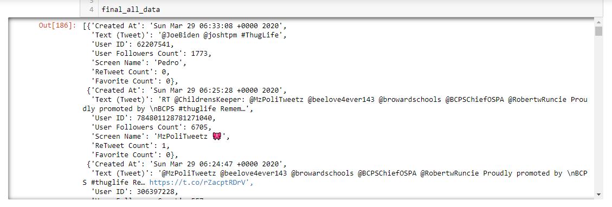

* Now that we have all the tweets in "final_all_data", the goal now is to extract all of these tweets keys and seperate them into their own lists or "Buckets".

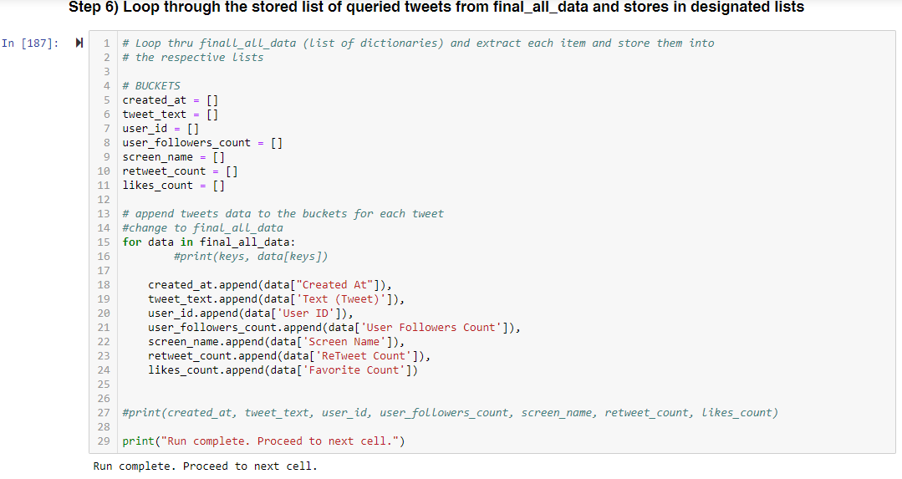

* Create a Pandas DataFrame using the lists we created from the last step.

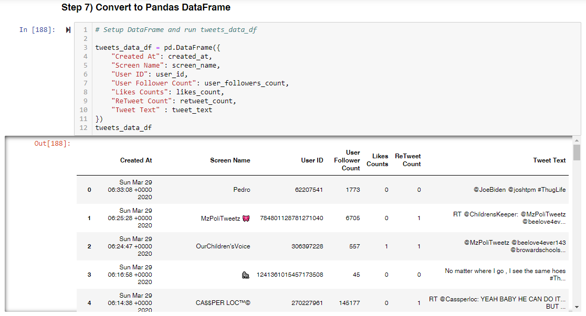

* Load the data into MySQL. This step was later added after I reiterated over this project to briefly display the ETL potential.
* Later, when I have more time, I can go back and clean up the "Screen Name" (can use the "User ID" as a alternative) and "Tweets Text", as I had to drop these columns to get them into MySQL.
* In the next few steps, I will save the raw tweets into a CSV file.
* To see more transformation "AKA data cleaning skills, please refer to my "youtube_top_trending_music_artists_ETL" repository.

* Results of after loading it into MySQL.
* 
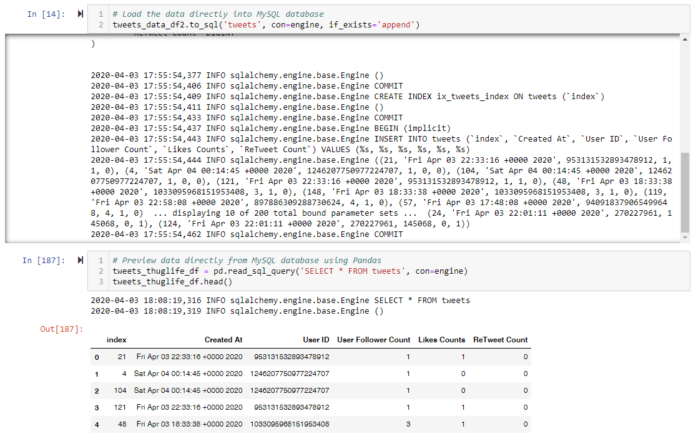
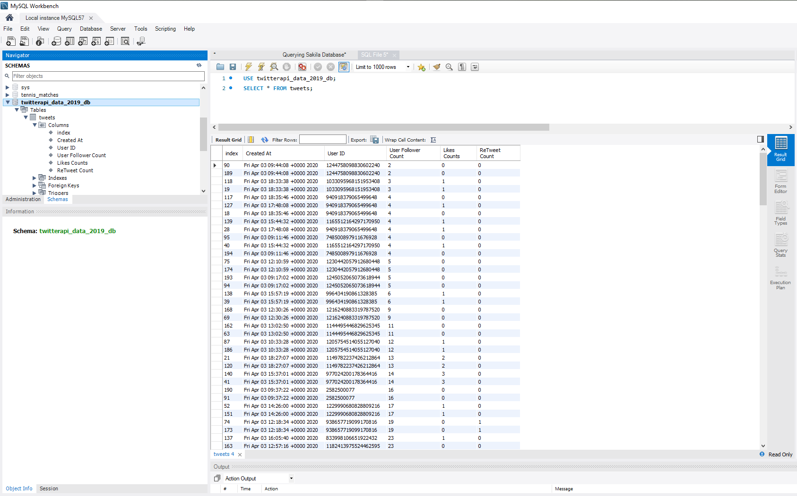

* Use Pandas to save the original output of the tweets data I gathered as a CSV file in the resources folders.

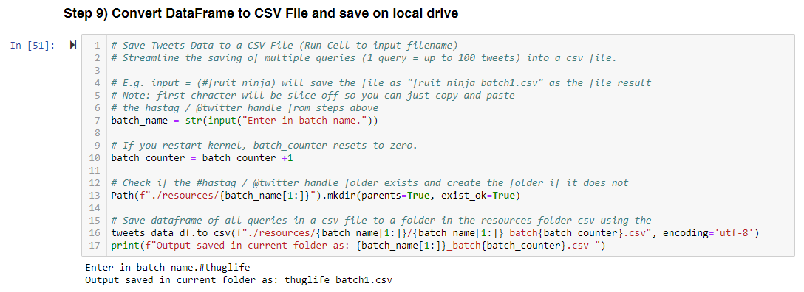

* Use glob to loop thru all the folders in the resources folder, and display all folder names. To see more, please view the Juypter Notebook by clicking on the "1_twitter_mining_func_scatter" link in the repository, and you can view it.

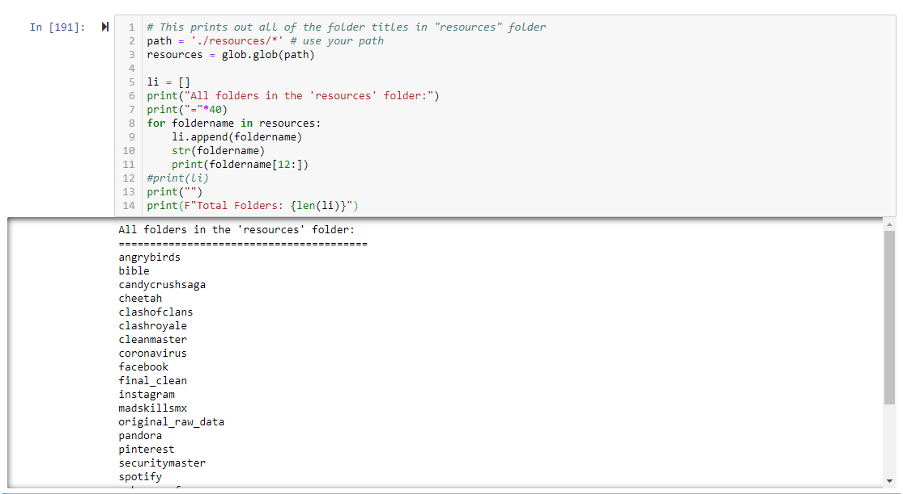

## Key Findings And Outputs

<!-- 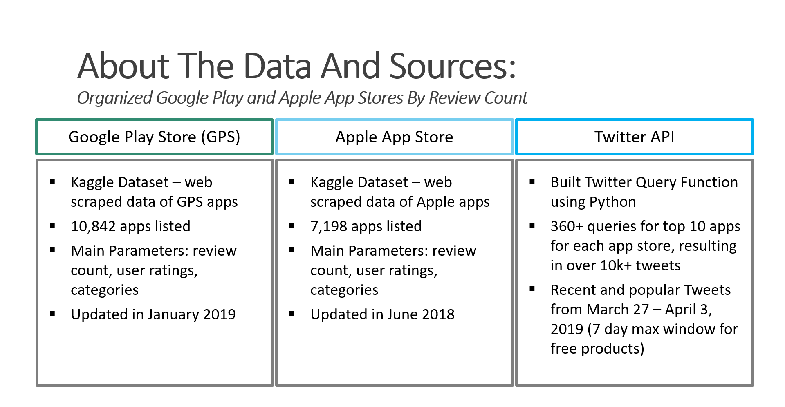 -->

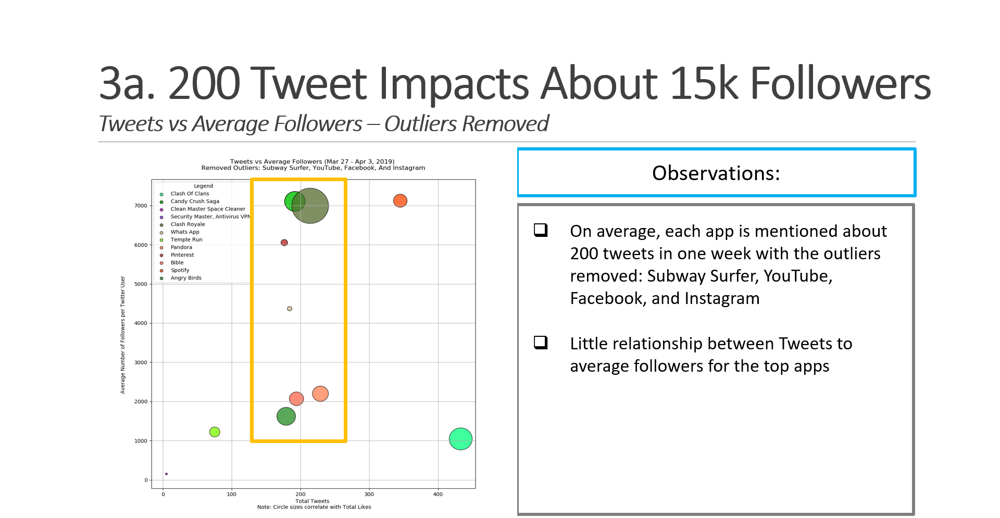
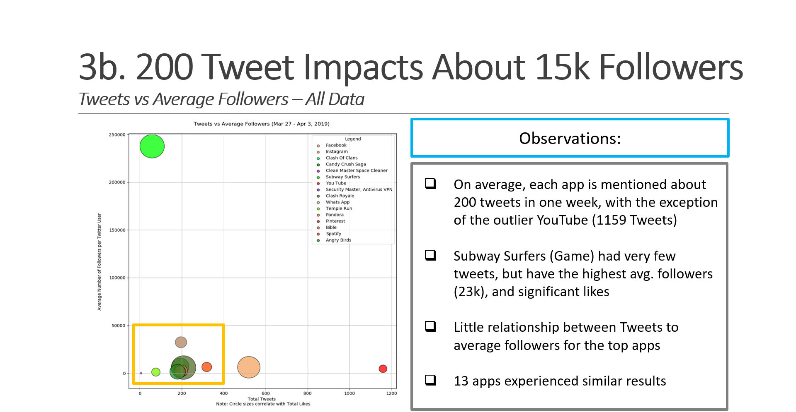

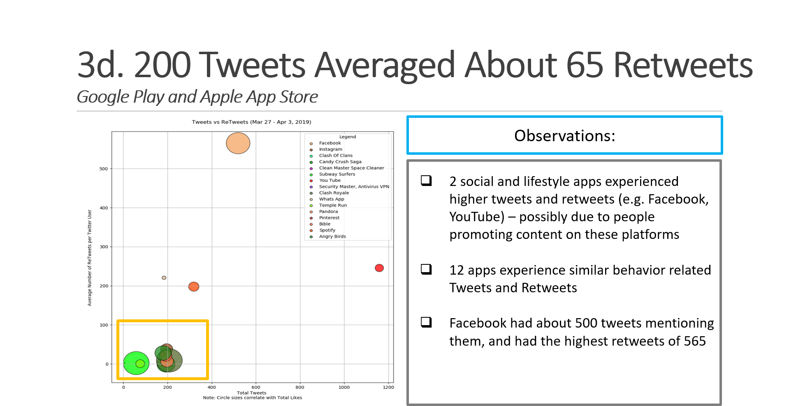

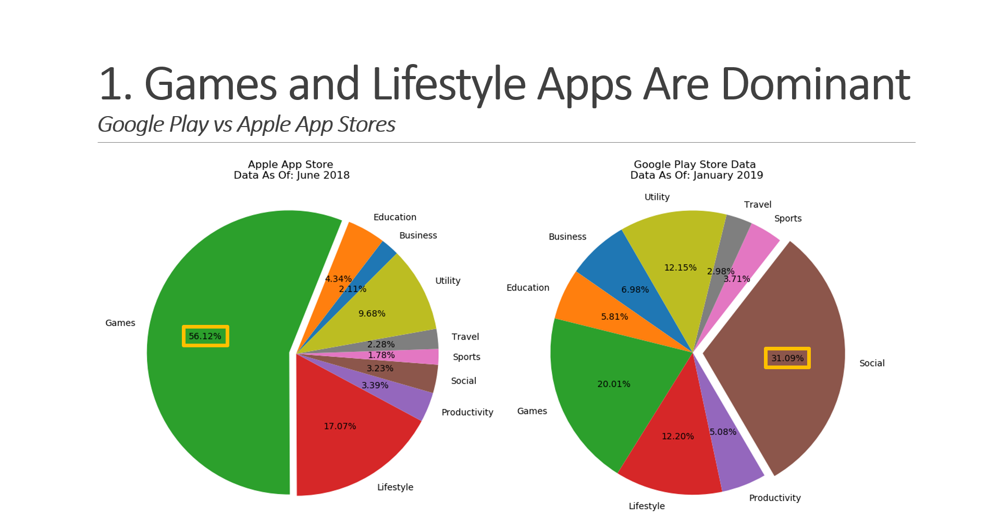
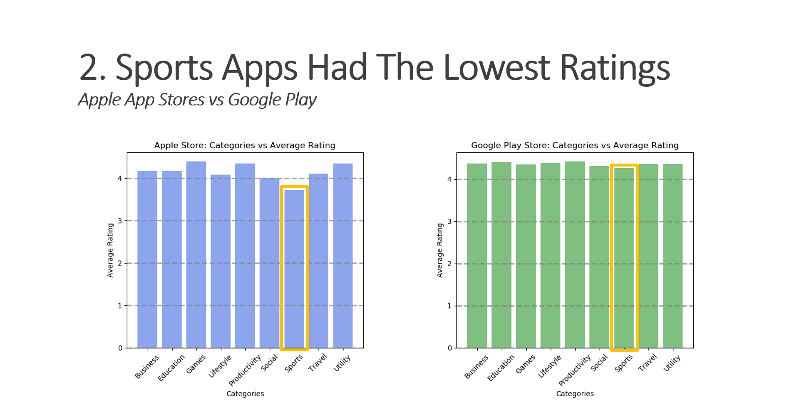
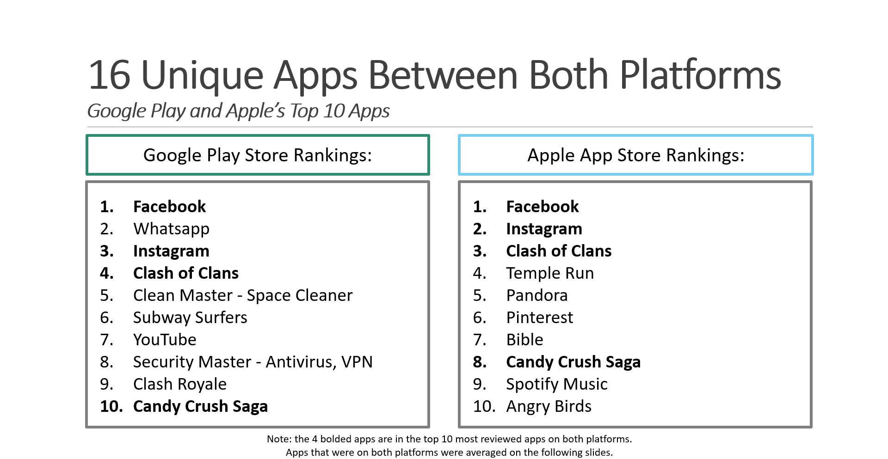

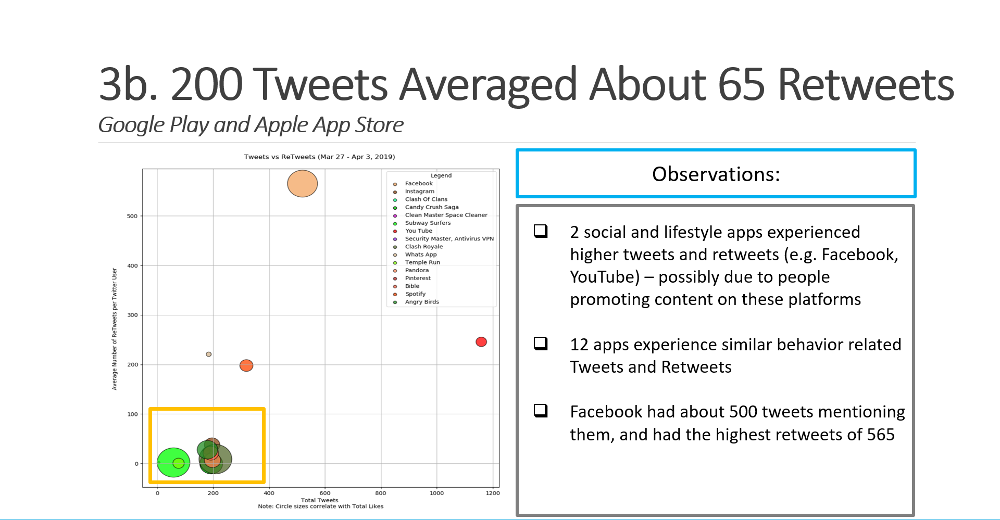

## Personal Note
* Thank you for your time and hope you enjoyed viewing our project!

## Author

* **Johneson Giang** - *Project Lead* - [Github](https://github.com/jhustles)
* Jeffery Anthony
* David Pham

## License

This project is licensed under the MIT License - see the [LICENSE.md](LICENSE.md) file for details

## Acknowledgments
* I definitely want to give a shout out to my dear teacher, mentor, and friend @CodingWithCorgis!