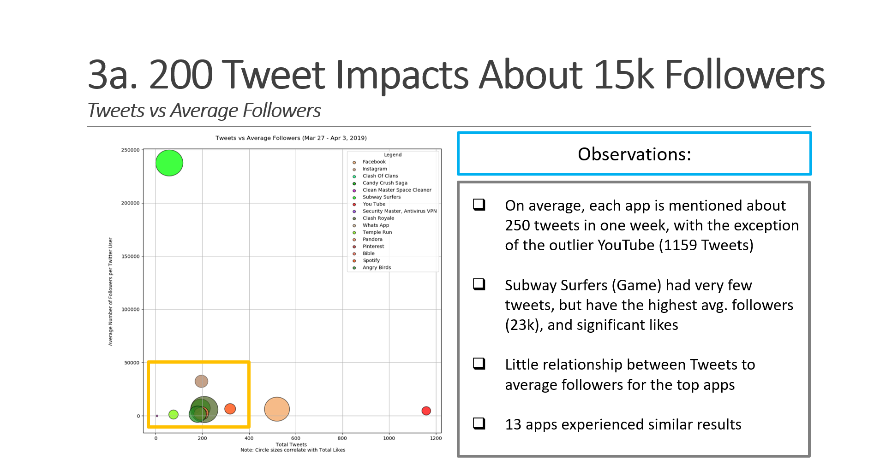
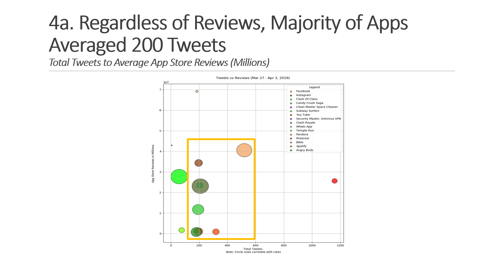
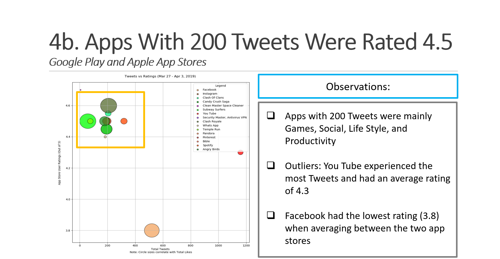
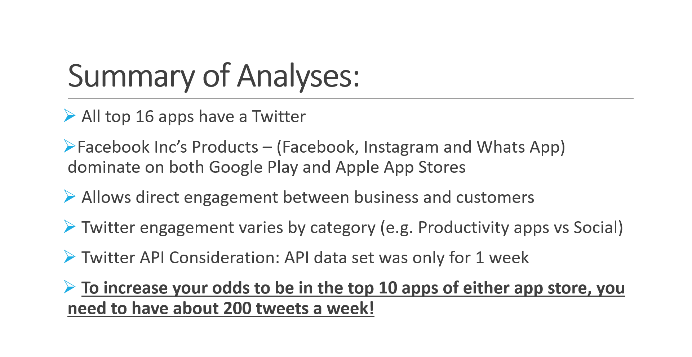

## Project Scope

For this project, we wanted to explore the impact of Twitter on the top 10 apps on the Apple App and Google Play Store based on webscraped data from Kaggle.com.
To accomplish this, it would require us to succesfully connect to Twitter's API, extract tweets, store them into csvfiles, and clean all datasets and analyze them for meaningful insights regarding:

* What is the population of apps, and types of apps?
* Which app categories had the highest ratings?
* What is the impact of Twitter Activity? Is it measurable, if so how?
* Is there a relationship between Twitter activity, ratings and reviews?
* Next Steps

We used Twitter's free API (non-enterprise) and was limited to a recent history of up to only 7 days, so our entire analysis was based on tweets data from a very small time period, thus our finding does not provide empirical or statistically significant evidence of our findings. Our goal from this project was to further develop Python progamming and data anlysis skills, and showcase our curiousity and passion.

## System Prerequisites
You will need the following installed on your computer system, if you want to replicate my analysis:
* Python >= 3.7 and the associated libraries:
  * OS
  * Sys
  * CSV
  * JSON
  * Simplejson
  * Requests
  * Pprint
  * Numpy
  * Pandas
  * Matplotlib
  * Twython - https://twython.readthedocs.io/en/latest/
  * String
  * Glob
  * Path
* Jupyter Notebook - all of the analyses and chart creations reside in these files

## Getting Started

* Viewing Source Code - if this is the route you'd like to go, then please click on the Jupyter Notebooks in the repository that I've numbered numerically as you can easily view these files via Github. Please view item #3 pdf to view my deck with all of the key insights we discovered from our project. 
* Clone / Download Entire Repository - if you'd like to replicate my work, please download / clone my repository and install all of the prerequisites. After, you can open the Jupyter Notebooks to see all of the raw calcuations and code.

## Key Findings And Outputs

## Author

* **Johneson Giang** - *Project Lead* - [Github](https://github.com/jhustles)
* Jeffery Anthony
* David Pham

## License

This project is licensed under the MIT License - see the [LICENSE.md](LICENSE.md) file for details

## Acknowledgments
* I definitely want to give a shout out to my dear teacher, mentor, and friend @CodingWithCorgis!
